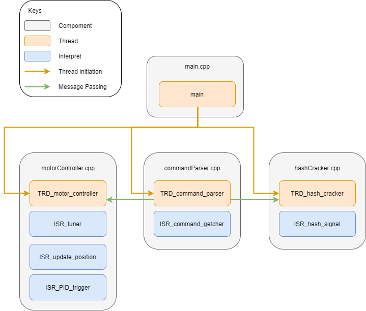

# Motor Control and Hash Cracking

## Requirement
In this project, we are required to
* Control motor to reach targeted rotation in both direction, with target speed ranging from 5 rps to 100 rps.
* Use pwm to generate melody
* Mining bitcoin while idle, at exact rate of 5000 nonces per second

Detailed requirement can be found from [`CW2-specification.pdf`](CW2-specification.pdf).

## File Structure
* `src` folder contains all the source file,
  * [`main.cpp`](src/main.cpp) for bootstrap
  * [`commandParser.cpp`](src/commandParser.cpp) for parsing serial input
  * [`hashCracker.cpp`](src/hashCracker.cpp) for hash cracking
  * [`motorController.cpp`](src/motorController.cpp) for control motor's rotations, speed and melody
* `include` folder contains the header files for the source files (except main.cpp)
  * It also contains [`dataStructure.hpp`](include/dataStructure.hpp) for declaring shared data structure and constant across source files.

## [Report](report.pdf)

The image above provide an overview of the components and how they interact.

More details and critical time analysis can be found in the [report](report.pdf).

## Installation
1. Follow [PIO](https://platformio.org/install) to install PIO on any platform you prefer. \
   Alternatively, open the root folder of this project in [VSCode](https://code.visualstudio.com/), install the recommended extension.
2. Plug in the mbed device, and run `upload` in PIO to upload to device. \
   If compile time is long (over 5 minutes), check `.mbedignore` file in folder `pio_core/packages/framework-mbed/components` are not overwritten.

## Compiled Bin
Located under folder [`bin/firmware.bin`](bin/firmware.bin)
